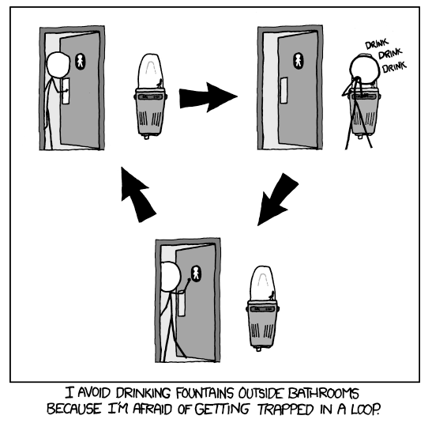
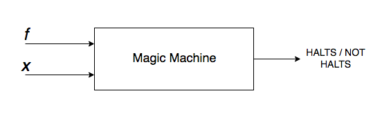
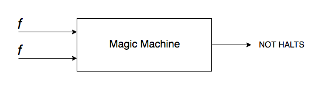
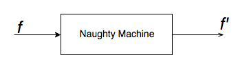
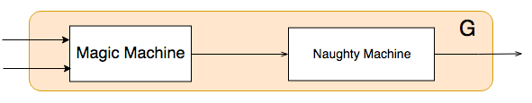
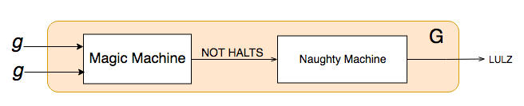
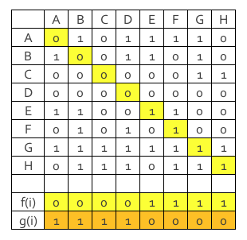

###### <span style="color:#808080;"><em>Picture Credits: xkcd</em></span>

Infinite Loops. We all know them.

A simple program like-

```java
while (true) {
  System.out.print("Hello, world");
}
```

will continue forever; whereas the program-

```java
System.out.print("Hello, world");
```

will execute that line and stop.

Sometimes, it is too obvious as in the example above. Other times, we have to rack our brains figuring out if any given program was entering in an infinite loop. Furthermore, in complicated programs, it is difficult to determine whether the program will not halt at all, or is just taking longer time to compute.

---

### 1. A Magic Machine

What if we had a magic machine which accepts any program _f_ and an any input _x._

Let's check if such a machine can exist-

###### Step 1:

Imagine that such a Magic Machine (M) indeed does exist. Also, imagine we have an infinite amount of resources available to run such a machine.

This machine simply outputs "HALTS" if program our _f_ will exit after computing  or "NOT HALTS" if _f_ will enter an infinite loop while computing _f(x)._



As an example, let's feed our magic machine to see what happens if _f_ is fed itself as an input. Let's assume it says the program does not halt.



###### Step 2:

Build a Naughty Machine "N" that accepts one input. This machine enters an infinite loop if the input is "HALTS" and stops when the input is "NOT HALTS". Basically, it does what it is not told to do. This should be easy to build.



###### Step 3:

Join the two machines together. Let's call this bigger machine G.  Let's call the joint program that they both execute as _g._



###### Step 4:

Let's feed this new machine G with its own program g.



Let's assume our Magic Machine outputs "NOT HALTS" when fed with g. That means that G is going in an infinite loop with this input. The naughty machine which is a part of G itself will negate that input print LULZ and then halt.

<p style="text-align:center;">
  <em><span style="color:#999999;"><span style="color:#000000;">G halted!  But our magic machine said G will not halt! </span><br /> </span></em>
</p>

We trusted our machine to determine correctly for all inputs. Our magic machine is a phony. It is not possible that such a machine exists.

---

### **2. The Halting Problem**

This is an overly simplified explanation of what is known as the halting problem. Turing proved that an algorithm to correctly determine whether a program will ever enter in an infinite loop or halt can never exist. As our example above, he stated that any such algorithm can be made to contradict itself and thus cannot be true.

Such problems that decide and output a binary true/false are known as decision problems or as Turing put it in German- Entscheidungsproblem. The Halting problem is one of the first examples of decision problem that is proved to be **_Undecidable_**.

---

### 3. Cantor's Diagonalization

If you are still not convinced, the existence of such an algorithm can be disproved using a nice technique known as Cantor's Diagonalization.

To start with, let's again imagine such a machine exists. The machine outputs 0 if a program *f*  does not halt on any input _x_ and 1 if it does halt.

What we do know, and is proved, is that the number of programs is countably finite. What we can have is a matrix of two inputs to our machine and the cells denote 1 or 0 depending on whether the system halts or not.

Assume there are no more than 8 programs in the world and we check each program against all as in our matrix below. The programs are named by the letters A to H. The outputs 0 and 1 are just assumed outputs of the magic machine.



The matrix shows rows that represent programs and columns that are input to our programs. By convention we should have covered all possibilities to prove that our machine is correct.

Now, let's pick up all the diagonal values of the matrix f(i) and invert them to g(i). You'll notice that we did not test our machine for this input! It does not exist in our matrix.

If you add this to your set of inputs and run the diagonalization again, you'll get another one! Each new input formed will differ in at least one bit.

You cannot just test the machine for all inputs! Such a machine cannot be built.

---

### 4. Significance

In addition of the relief to know that computers will not be able to outsmart human beings, the halting problem is extremely useful in the process of _reduction_. If any given problem P can be reduced to the halting problem, it can be proved that no solution exists for P and so is undecidable.

######
