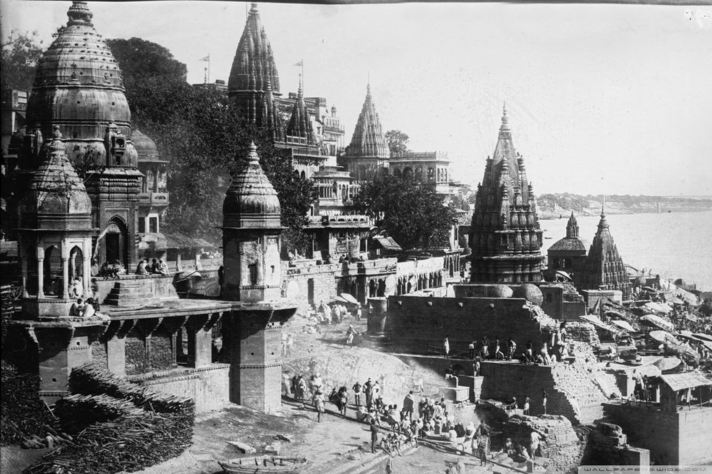
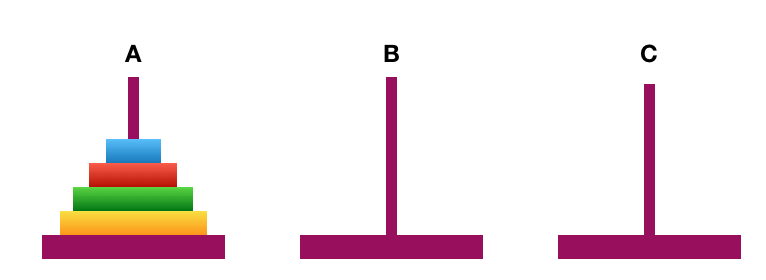
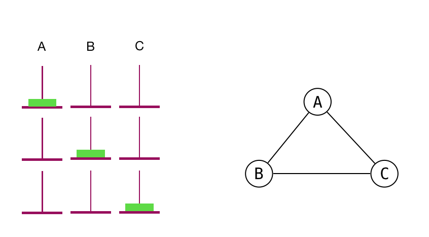
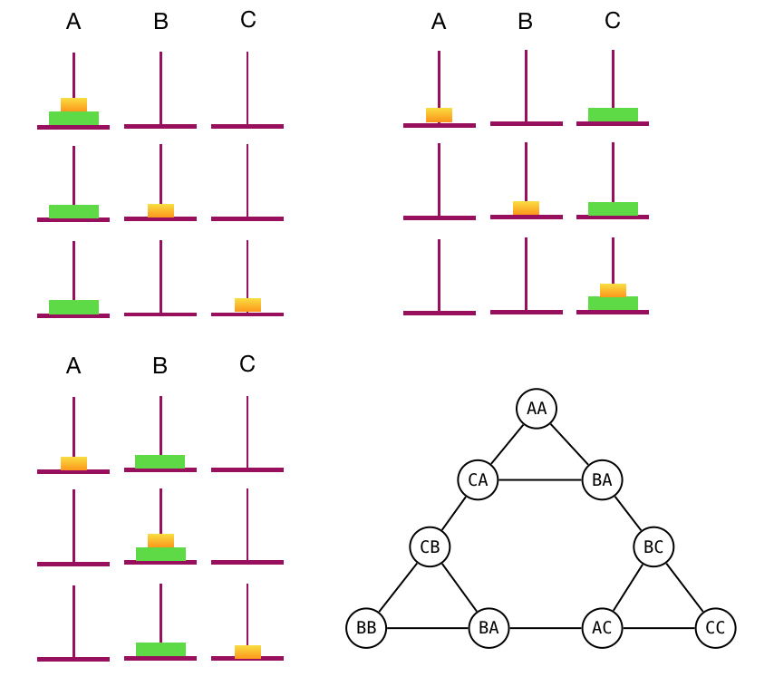
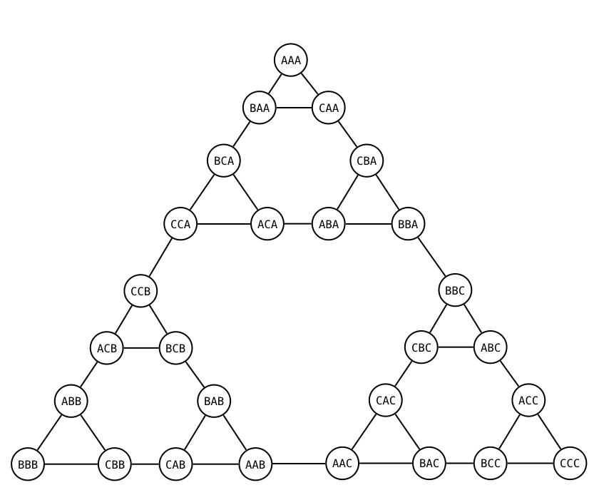
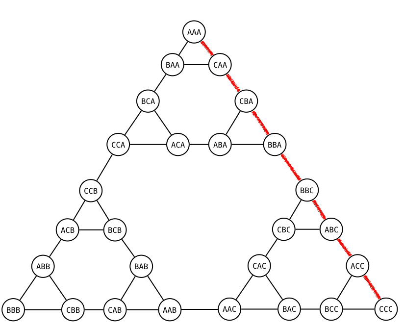
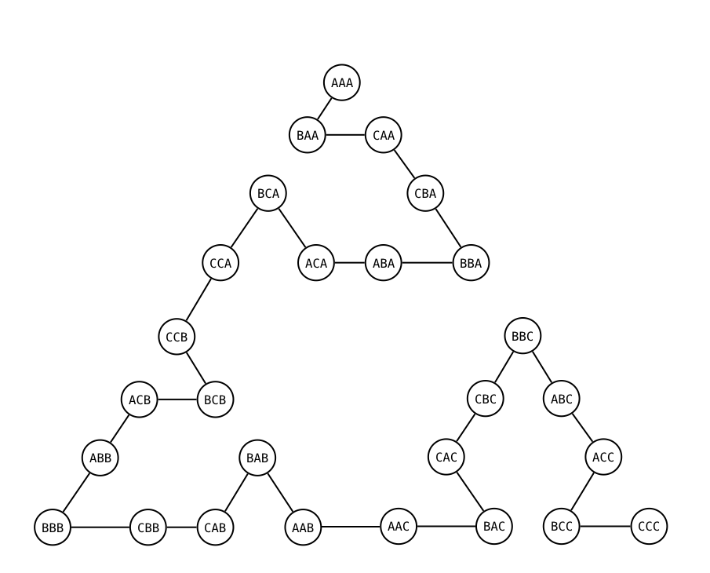
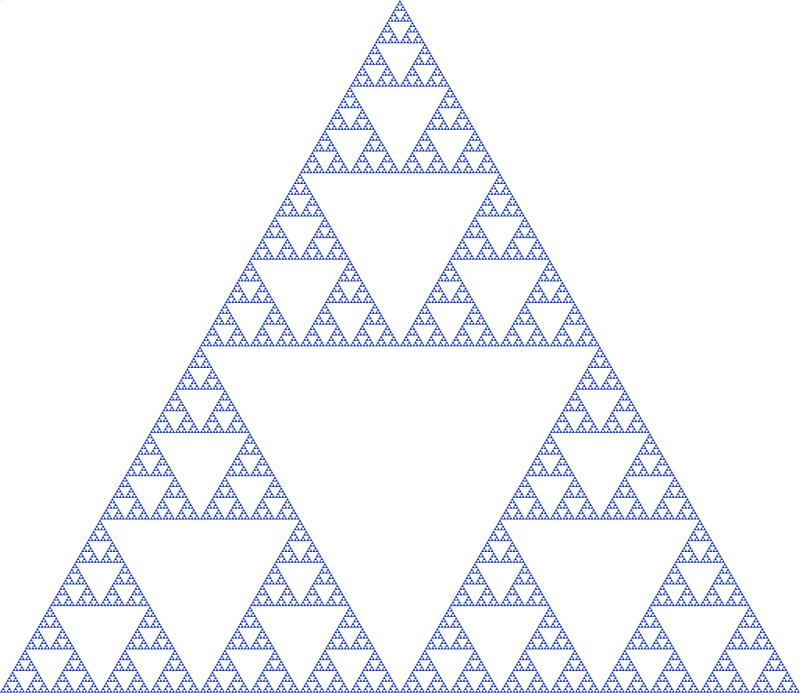

### 1. Background

As a legend goes, there's a spacious room in Kashi Vishwanath, India that consists of posts surrounded by 64 golden disks, each smaller than the other. Priests at the temple have been moving the disks according to the perpetual rules of Lord Brahma. It is believed that once the last move of this puzzle is completed, the world will end.



If you're already biting your nails in worry that the its apocalypse any moment now, relax. Even if the priests move the rings at one per second, it will take them 585 billion years to complete the puzzle, which is supposedly 42 times the current age of the universe.

---

### 2. Rules of the game



Rules of the game are simple.

There are three posts A, B, C. One of them, say A has 4 discs, each bigger than the other. You are supposed to move all discs from A to C, using B as auxiliary. You are not however, in any step, allowed to place a bigger disc over a smaller one.

---

### 3. A Recursive Strategy

Let's try to examine the problem; in the problem of 4 discs, lets glue the largest yellow disc for the time being. We will move the remaining 3 discs to tower B, using C as the auxiliary.  After all remaining three are on B, we can easily move the largest disc to C. One step complete! We have remaining three discs on tower B, which can be viewed as a similar problem - move all these three to tower C, using A as auxiliary. Which is a problem of 2 discs, if the largest amongst these the green disc is kept glued.

Do you notice the pattern?

In general, a problem of N discs can be divided into a problem of N-1 discs. We have a recursion. We will continue our recursion only till we hit a base case of n = 1.

A method can be defined as -;

```java
func towersOfHanoi(numberOfDiscs, from, to, using) {
  if(n > 0) {
    towersOfHanoi(numberOfDiscs-1, A, B, C);
    System.print("Moving disc from " + from + " to " + to);
    towersOfHanoi("numberOfDiscs-1, B, C, A);
  }
}
```

Quite simple so far. Let's try to figure out some math.

---

### 4. Solving the Recurrence

The first and third line divide the problem into sub-problem that is 1 less than our original problem. Thus, if is the original problem,  we now have two sub-problems, each size. The middle step is just some output operation which we will treat as constant time O(1). So, we have-


As per recursion-


We know the base case which comes at .


This looks like a Geometric series-


And we have a closed form for our recurrence.

As it is obvious from that, the algorithm that we have here runs in time.

---

### 5. Towers of Hanoi and Graphs

Here's the most interesting part of the problem. The game can be represented as an undirected graph, at times called the state space graph.

Lets take a 1 disc Hanoi Puzzle. We will represent the possibilities that the only disc can be on with nodes in the graph - alternatively can be termed as states in the game. The edges denote the state transitions meaning the discs can move between those games.

The picture below shows three possibilities of the green disc. It can move freely from A to B to C and back to A.



Lets now consider 2 discs. To do this, we will keep the bigger green disc constant. As the yellow one is smaller, it can move freely from A to B to C to A. The yellow disc can behave in a similar manner when the green one is on B or C. However, when the yellow one is on C, the green can move only to B.

The graph beside the towers is what get when we draw the transition graph for 2 disc puzzle. Here, we denote two letters to denote the smaller disc followed by bigger disc. eg. CA means the yellow disc is on C and green one on A.

Possible states and graph for 2 discs Towers of Hanoi puzzle


Here's a similar ready-made state space graph for 3 disc Towers of Hanoi puzzle. It is evident that the graph contains 3 nodes for 1 disc, 9 nodes for 2 discs, 27 nodes for 3 discs and so on. In general, the graph contains nodes for n discs. It shows all the possible states the game can end up in, with the final states as the end of the vertices of the bigger triangle &#8212; AAA, BBB and CCC wherein all the discs are on a single post.



#### 5.1 The most efficient solution



This isn't just a depiction of states. It is not difficult to determine that the most efficient solution, the one with the fewest steps is the edge of the bigger triangle from the start state to the end state. Here's an example - You got all discs on A, which is AAA. start with moving the smallest one to C, you get CAA and continue along the right edge of the triangle marked as red. You will reach the solution in exactly steps which is the closed form of our recurrence we obtained!

#### 5.2 The worst solution



What's the worst you can do (provided you don't go back to the same state again, in which case its ) ?. The answer is to try out all the possible states in the graph before ending up in the winning state. That's equivalent to visiting all vertices in our graph exactly once. This is incidentally also the most optimized solution to a constrained Towers of Hanoi problem wherein you are allowed to move discs only to adjacent posts. ie. move from A to C and C to A is illegal.

####


Fun fact - The graphical representation of the game with some arbitrary large number discs is a beautiful large triangular fractal structure known as Sierpinski's Triangle.

In addition to being a fundamental problem in learning recursion, the Towers of Hanoi puzzle is also used in neuropsychological diagnosis in analyzing deficits in frontal lobe of our brain.
